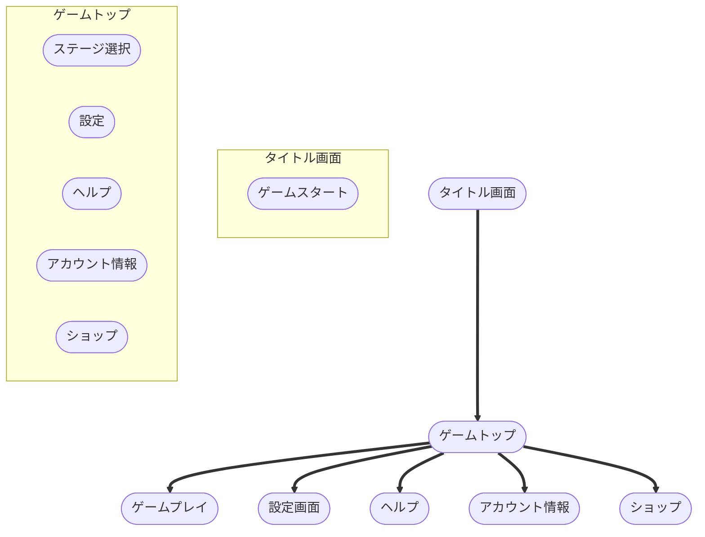
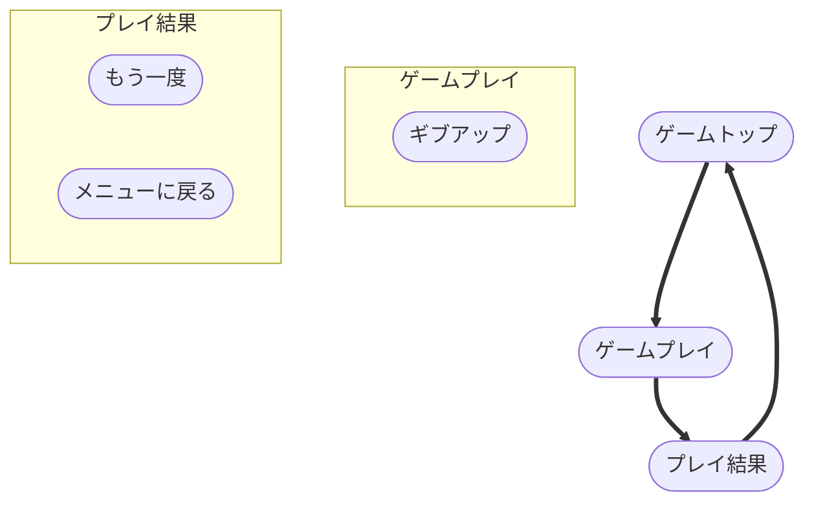
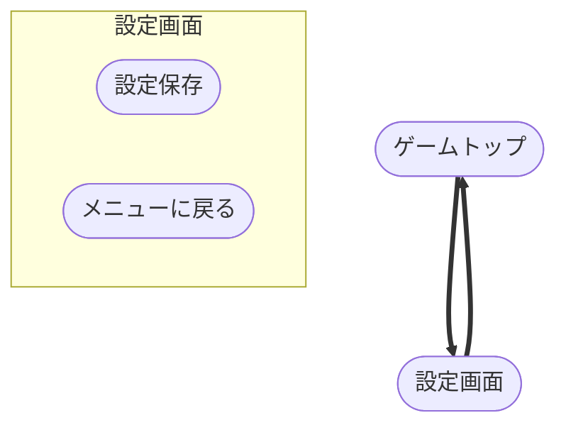
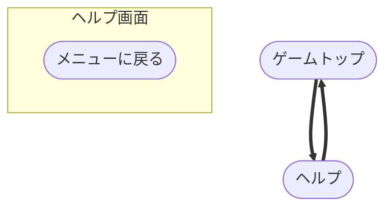
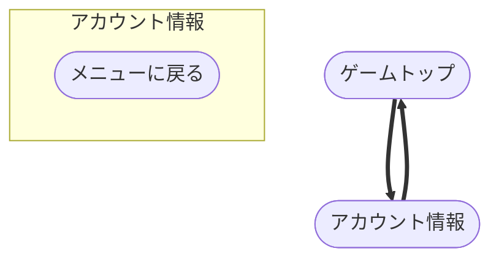
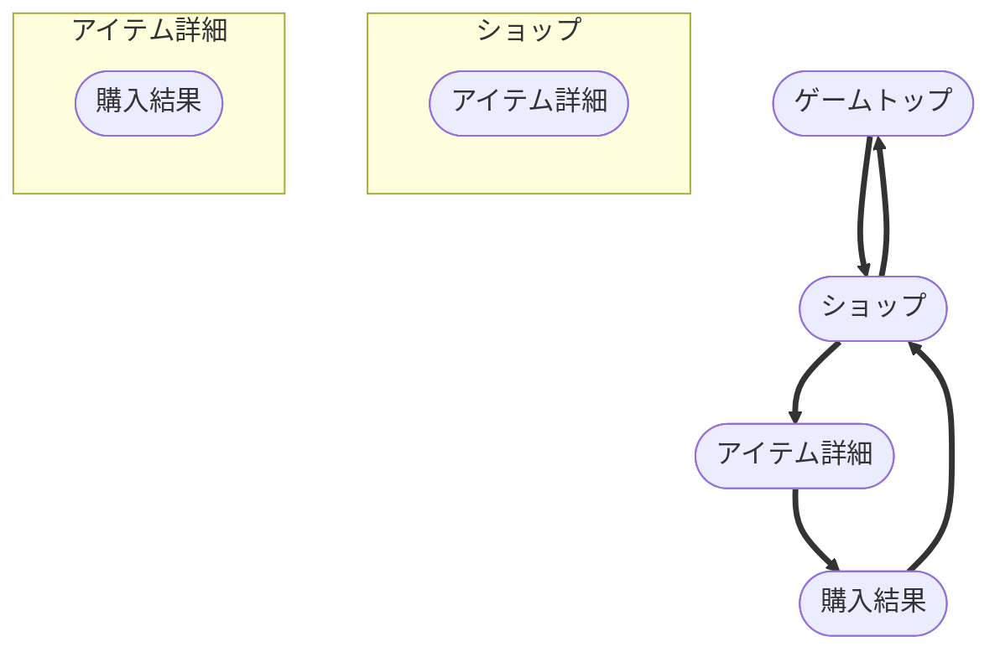

# BubblePop ページフロー図

## 概要
このドキュメントでは、BubblePopゲームの画面遷移フローをMermaidフローチャートで表現しています。各画面間の遷移関係と、画面内で利用可能な操作を視覚的に示しています。

## メイン画面遷移フロー

### タイトル画面からゲームトップへの遷移

## ゲームプレイフロー

### ゲームプレイから結果画面への遷移

## 設定画面フロー

### 設定画面の遷移

## ヘルプ画面フロー

### ヘルプ画面の遷移

## アカウント情報画面フロー

### アカウント情報画面の遷移

## ショップ画面フロー

### ショップからアイテム詳細、購入結果への遷移

## フロー図の説明

### 画面遷移の特徴
- **放射状構造**: ゲームトップを中心とした画面遷移
- **一貫した戻り方**: 各画面からゲームトップへの統一された戻り
- **シンプルな流れ**: 複雑な画面遷移を避けた直感的な設計

### 操作要素の説明
- **ボタン・リンク**: `([])`で囲まれた画面遷移用の要素
- **subgraph**: 各画面内で利用可能な操作をグループ化
- **矢印**: 画面間の遷移関係を示す

### 主要な遷移パターン
1. **タイトル → ゲームトップ**: ゲーム開始
2. **ゲームトップ → 各機能画面**: メニュー選択
3. **各機能画面 → ゲームトップ**: メニューに戻る
4. **ゲームプレイ → 結果 → ゲームトップ**: ゲームループ
5. **ショップ → 詳細 → 結果**: 購入フロー

## 技術実装への活用

### React Router での実装
- 各画面をRouteとして定義
- フローチャートに基づく画面遷移の実装
- ブラウザの戻るボタンとの連携

### 状態管理
- 画面遷移時の状態保持
- 画面間でのデータ受け渡し
- ユーザーの操作履歴管理

