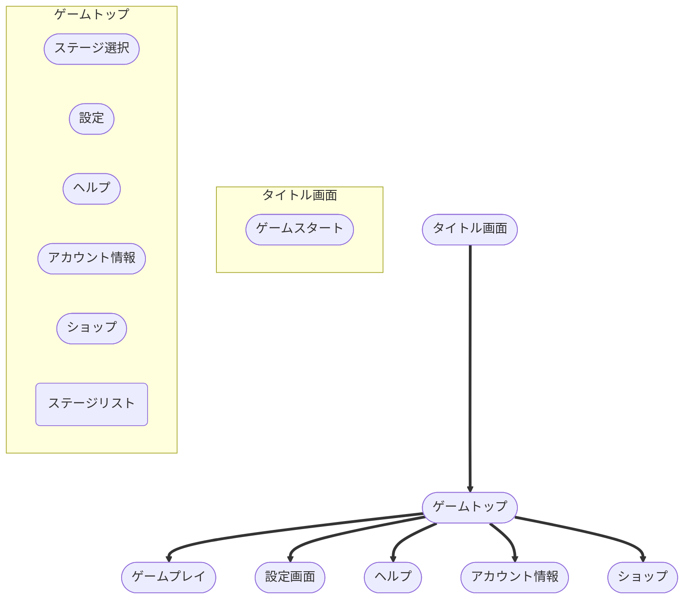
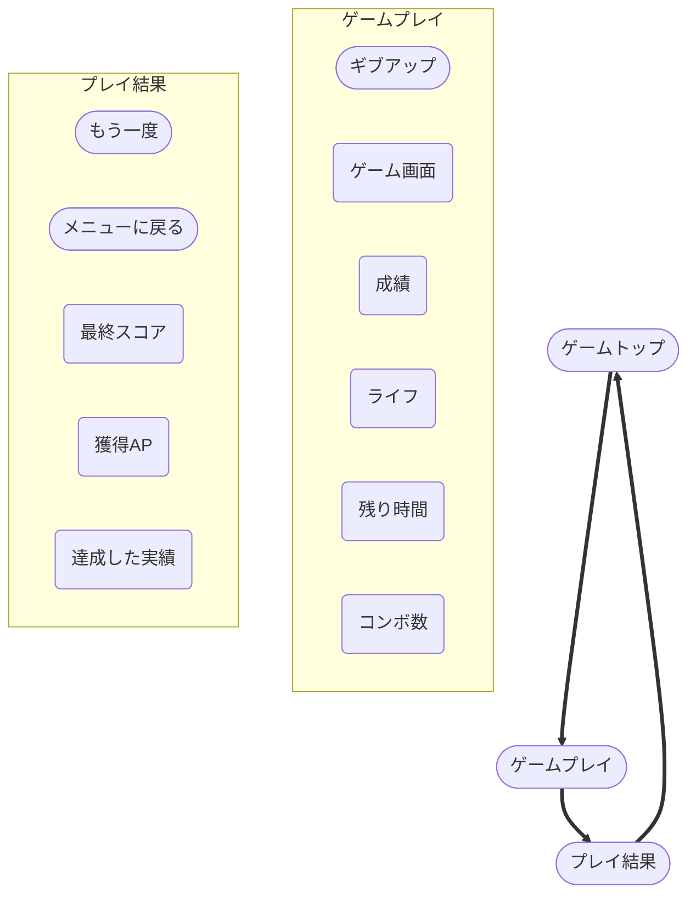
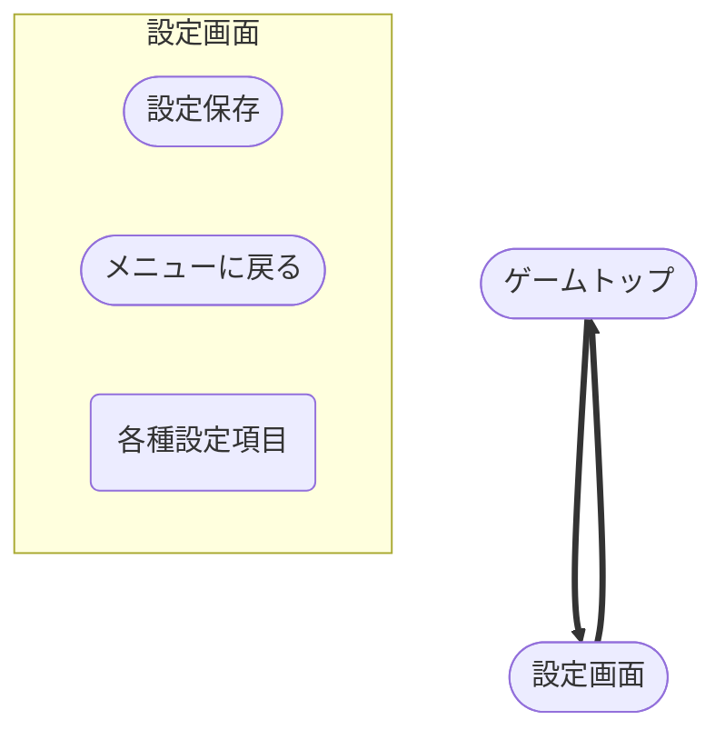
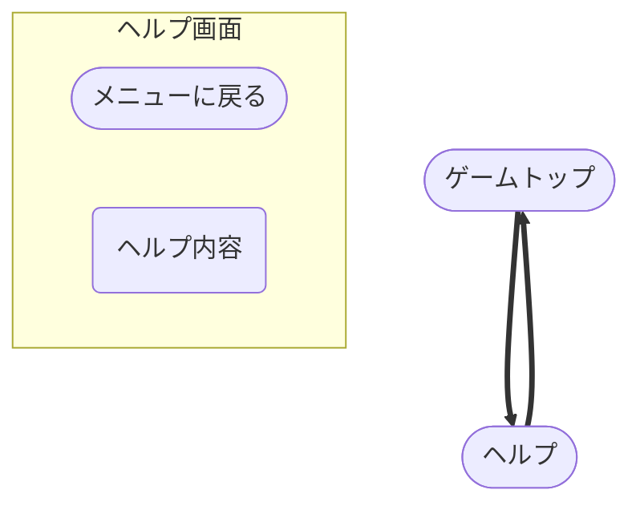
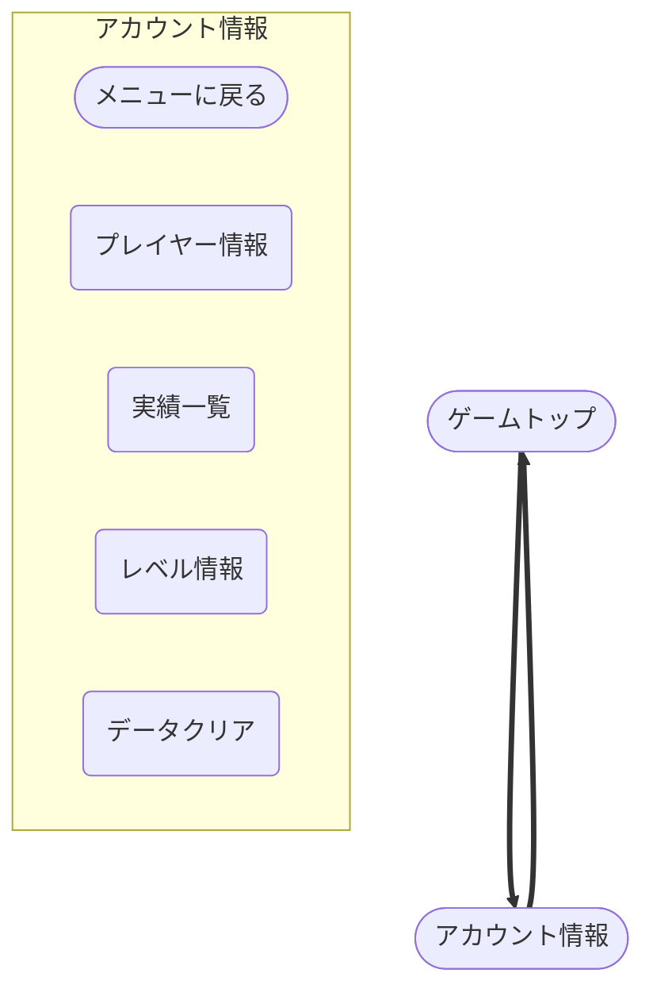
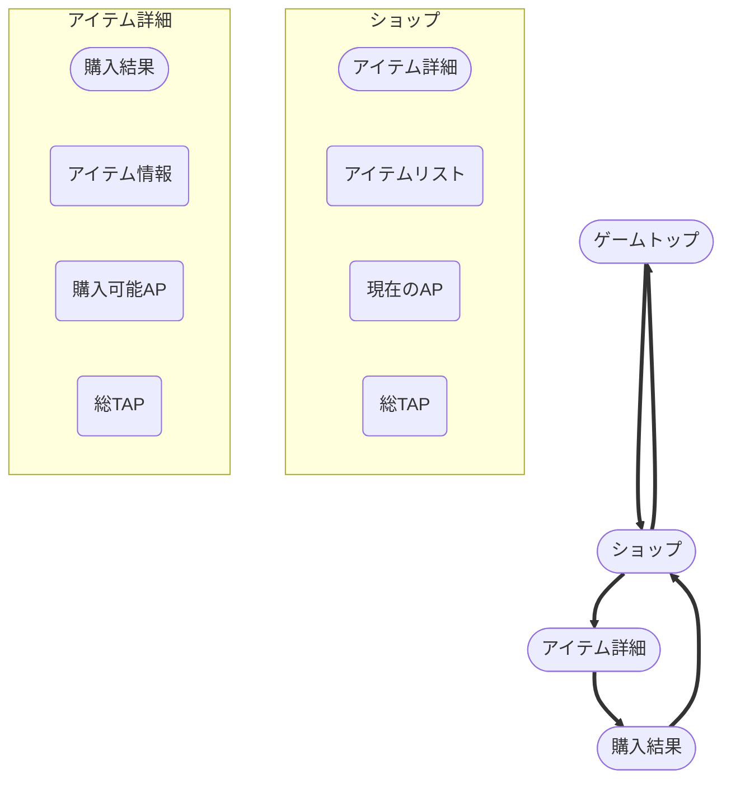

```mermaid
flowchart TD
    TITLE(["タイトル画面"])
    TOP(["ゲームトップ"])
    GAME(["ゲームプレイ"])
    SETTING(["設定画面"])
    HELP(["ヘルプ"])
    ACCOUNT(["アカウント情報"])
    SHOP(["ショップ"])
    TITLE ==> TOP
    TOP ==> GAME
    TOP ==> SETTING
    TOP ==> HELP
    TOP ==> ACCOUNT
    TOP ==> SHOP

    subgraph タイトル画面
        A(["ゲームスタート"])
    end

    subgraph ゲームトップ
        B1(["ステージ選択"])
        B2(["設定"])
        B3(["ヘルプ"])
        B4(["アカウント情報"])
        B5(["ショップ"])

        _B("ステージリスト")
    end
```

```mermaid
flowchart TD
    TOP(["ゲームトップ"])
    GAME(["ゲームプレイ"])
    GAME_RESULT(["プレイ結果"])
    TOP ==> GAME
    GAME ==> GAME_RESULT
    GAME_RESULT ==> TOP

    subgraph ゲームプレイ
        A(["ギブアップ"])

        _A1("ゲーム画面")
        _A2("成績")
        _A3("ライフ")
        _A4("残り時間")
        _A5("コンボ数")
    end

    subgraph プレイ結果
        B1(["もう一度"])
        B2(["メニューに戻る"])

        _B1("最終スコア")
        _B2("獲得AP")
        _B3("達成した実績")
    end
```

```mermaid
flowchart TD
    TOP(["ゲームトップ"])
    SETTING(["設定画面"])
    TOP ==> SETTING
    SETTING ==> TOP

    subgraph 設定画面
        A1(["設定保存"])
        A2(["メニューに戻る"])

        _A1("各種設定項目")
    end
```

```mermaid
flowchart TD
    TOP(["ゲームトップ"])
    HELP(["ヘルプ"])
    TOP ==> HELP
    HELP ==> TOP

    subgraph ヘルプ画面
        A(["メニューに戻る"])

        _A1("ヘルプ内容")
    end
```

```mermaid
flowchart TD
    TOP(["ゲームトップ"])
    ACCOUNT(["アカウント情報"])
    TOP ==> ACCOUNT
    ACCOUNT ==> TOP

    subgraph アカウント情報
        A(["メニューに戻る"])

        _A1("プレイヤー情報")
        _A2("実績一覧")
        _A3("レベル情報")
        _A4("データクリア")
    end
```

```mermaid
flowchart TD
    TOP(["ゲームトップ"])
    SHOP(["ショップ"])
    ITEM_DETAIL(["アイテム詳細"])
    BUY_RESULT(["購入結果"])
    TOP ==> SHOP
    SHOP ==> TOP
    SHOP ==> ITEM_DETAIL
    ITEM_DETAIL ==> BUY_RESULT
    BUY_RESULT ==> SHOP

    subgraph ショップ
        A(["アイテム詳細"])

        _A1("アイテムリスト")
        _A2("現在のAP")
        _A3("総TAP")
    end

    subgraph アイテム詳細
        B(["購入結果"])

        _B1("アイテム情報")
        _B2("購入可能AP")
        _B3("総TAP")
    end
```

